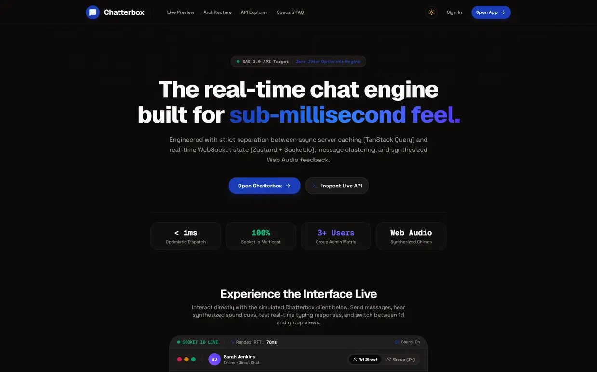

# Chatterbox — Real-Time Chat & Collaboration Platform

> Frontend Developer Take-Home Assignment Deliverable.  
> Built with Next.js 16 (App Router), React 19, TypeScript, TailwindCSS, Zustand, TanStack Query, and Socket.io.

**Repository**: https://github.com/ornobaadi/Chatterbox
**Live Demo**: https://chatterbox-space.vercel.app/



---

## 1. Overview & Deliverables

This repository contains the complete implementation for all three parts of the assignment:

1. **Part 1 — API Documentation & Core Chat Application**:
   - Standalone API documentation: [`docs/API.md`](docs/API.md).
   - Zero-friction authentication (login & auto-registration via phone + name).
   - Real-time direct (1:1) and group messaging powered by Socket.io (`message:new`, `conversation:updated`).
   - Optimistic message sending with instant UI render, status reconciliation (`sending` ➔ `sent`), and inline retry on network error (`status: failed`).
   - Message clustering with vertical rhythm compression for consecutive messages by the same sender.
   - Smart history auto-scroll protection with floating `New messages ↓` pill affordance.
   - Comprehensive group management (3+ members, admin promotions, add/remove participants, rename group, leave group).
   - Custom bubble-shaped loading skeletons and zero-dead-state empty/error handlers.
2. **Part 2 — Creative Landing Page**:
   - Bespoke hero layout with custom typography (Geist + Space Grotesk).
   - **Interactive Live Chat Simulation**: A working interactive preview widget allowing visitors to type messages and receive simulated real-time replies directly on the landing page before logging in.
3. **Part 3 — Architectural Write-Up**:
   - Documented in detail below.

---

## 2. Architecture & Technical Decisions

### 2.1 State Management: TanStack Query vs. Zustand Separation
A key architectural principle in this codebase is the strict separation between **Server Cache** and **Client/Session State**:

- **TanStack Query (`@tanstack/react-query`)**:
  - Manages asynchronous server state: fetching conversations list, message history, user search results, and API mutation flows.
  - Provides automatic cache invalidation, window refetching, and error/loading state handling out of the box without manual reducer boilerplate.
- **Zustand (`zustand`)**:
  - Manages client-side session state (auth token, user profile) and the high-frequency **active real-time chat stream**.
  - Serves as the single synchronization hub where optimistic local messages and Socket.io broadcasts (`message:new`) converge, deduplicate, and reconcile.

### 2.2 Send Path Decision: REST (`POST /messages`) vs Socket (`message:send`)
The backend provides two potential routes to send a message: REST endpoint `POST /api/messages` and Socket.io event `message:send`.

- **Decision**: We chose **REST `POST /messages` for sending** coupled with **Socket.io `message:new` for real-time broadcasts**.
- **Rationale**:
  1. Standard HTTP status codes (200, 400, 401, 500) provide deterministic error handling for TanStack Query mutations.
  2. Plays cleanly with our optimistic UI pattern: a local temporary message (`tempId`, `status: "sending"`) is created instantly. On HTTP success, it reconciles with the real server `_id` and timestamp; on HTTP failure, it cleanly transitions to `status: "failed"` with an inline Retry button.
  3. The `message:new` socket listener receives messages from other participants and appends them to the store with deduplication against any pending optimistic ID.

### 2.3 Real-Time Transport: Socket.io
- Connected directly to the server root (`https://frontend-task-chatapp.onrender.com`) using JWT token auth passed in the handshake options.
- Listens to `message:new` for incoming direct/group messages and `conversation:updated` for live group metadata/membership alterations.

---

## 3. Design & Micro-Interaction Choices

- **Material 3 Expressive & Tactile Styling**: Confident primary indigo/violet accents paired with warm neutral card elevations, subtle border contrasts, and glassmorphic header backdrops.
- **Message Clustering**: Consecutive messages from the same sender within 2 minutes merge vertically, flattening adjacent border radiuses and suppressing redundant sender avatars in group chats.
- **Smart Auto-Scroll**: When at the bottom, incoming messages automatically scroll smoothly. If the user has scrolled up to inspect earlier chat history, auto-scroll is paused and a floating `New messages ↓` pill appears, preserving the user's reading position.
- **Accessible Composer**: Auto-growing multi-line textarea with keyboard support (`Enter` to send, `Shift+Enter` for new lines) and strict whitespace validation.

---

## 4. API Quirks & Notes (Discovered via Live Probing)

During our pre-implementation API inspection, several nuances were discovered and formalized:
1. **Group Conversation Creation**: Requires payload `{ name: string, participantIds: string[] }` (instead of `participants`).
2. **Direct Conversation Creation**: Requires payload `{ userId: string }`.
3. **Socket Message Format**: The `message:new` socket payload provides `id` (instead of `_id`) and `createdAt` as a millisecond epoch number (rather than ISO string). The frontend normalizes both into a unified `Message` entity.
4. **Group Admin Permissions**: Server enforces that only existing admins or group creators can add participants, promote members to admin, or rename groups.
5. **Login with an existing phone, different name**: assumed the submitted `name` on each login call is used as-is (no merge/ignore logic against a previously stored name), since the endpoint doesn't document this behavior. Not exhaustively verified against the live server, flagging as an assumption rather than a confirmed fact.
6. **Message history pagination**: `GET /conversations/{id}/messages` is called with no pagination parameters, the endpoint returns full history in one response. No pagination was implemented as a result, see "What I'd Improve" below.

---

## 5. AI Tool Usage Disclosure

In the spirit of transparency per the assignment guidelines:
- **AI Accelerated**:
  - Probing scratch scripts used to test backend response payloads.
  - Boilerplate generation for TypeScript schema definitions and initial component scaffolds.
  - Interactive simulated chat widget logic for the landing page.
- **Manually Refined & Custom Crafted**:
  - Dual state management synchronization architecture (TanStack Query + Zustand).
  - Optimistic message reconciliation and deduplication logic for Socket.io events.
  - Smart auto-scroll viewport detection and clustering algorithms.
  - Visual design tokens, custom typography pairing, and responsive layouts.

---

## 6. What I'd Improve With More Time

- **Pagination for message history**: the current implementation fetches full conversation history in one call. With more time I'd confirm the API's pagination support and add cursor-based loading for long conversations, so a chat with thousands of messages doesn't load everything up front.
- **Automated tests**: the optimistic-send/reconcile/retry logic, auto-scroll threshold, and message-clustering window are exactly the kind of state logic that's easy to silently break during a refactor. A handful of focused tests around `chatStore.ts` and the scroll-detection logic in `MessagePanel.tsx` would be the highest-value addition.
- **Reconnection message queue**: if the socket disconnects mid-session, outgoing sends still go through REST so they're not lost, but there's no queued replay for messages composed while fully offline. Worth handling explicitly rather than relying on the retry button alone.
- **Accessibility pass**: keyboard navigation and ARIA labeling in the group management modal and emoji picker weren't a focus given the timeline, worth a dedicated pass.
- **Landing page copy**: a couple of the performance stats on the landing page (sub-millisecond dispatch, etc.) are more illustrative than measured, I'd replace them with either real benchmarks or plainer, honest language.
- **Typing indicators / read receipts**: the API doesn't expose these directly, a client-only simulated typing indicator (clearly labeled as such) would've been a reasonable bonus if time allowed.

---

## 7. Running Locally

```bash
# 1. Clone repository
git clone <repo-url>
cd Chatterbox

# 2. Install dependencies
pnpm install

# 3. Start development server
pnpm dev

# 4. Open http://localhost:3000 in your browser
```

### Scripts
- `pnpm dev`: Start Next.js development server.
- `pnpm build`: Build production bundle.
- `pnpm start`: Run production server.
- `pnpm typecheck`: Run TypeScript compiler check without emitting files.
- `pnpm lint`: Run ESLint checks.